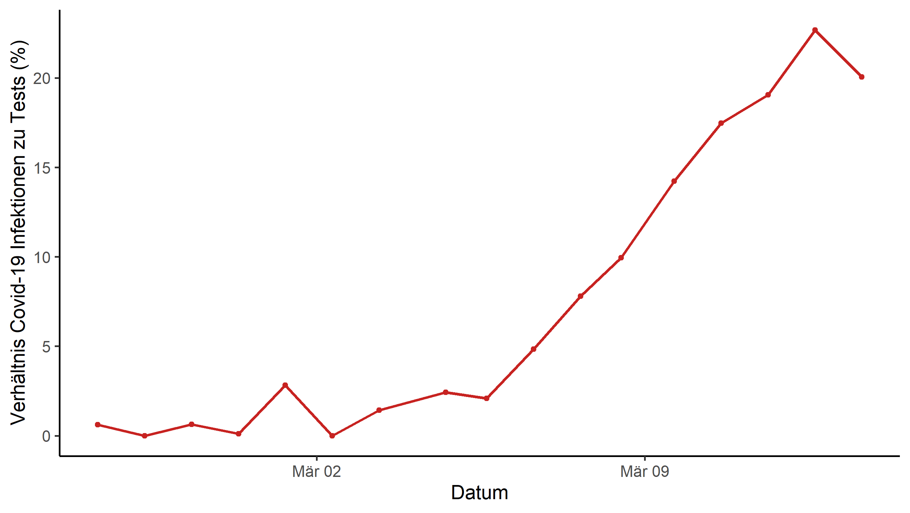
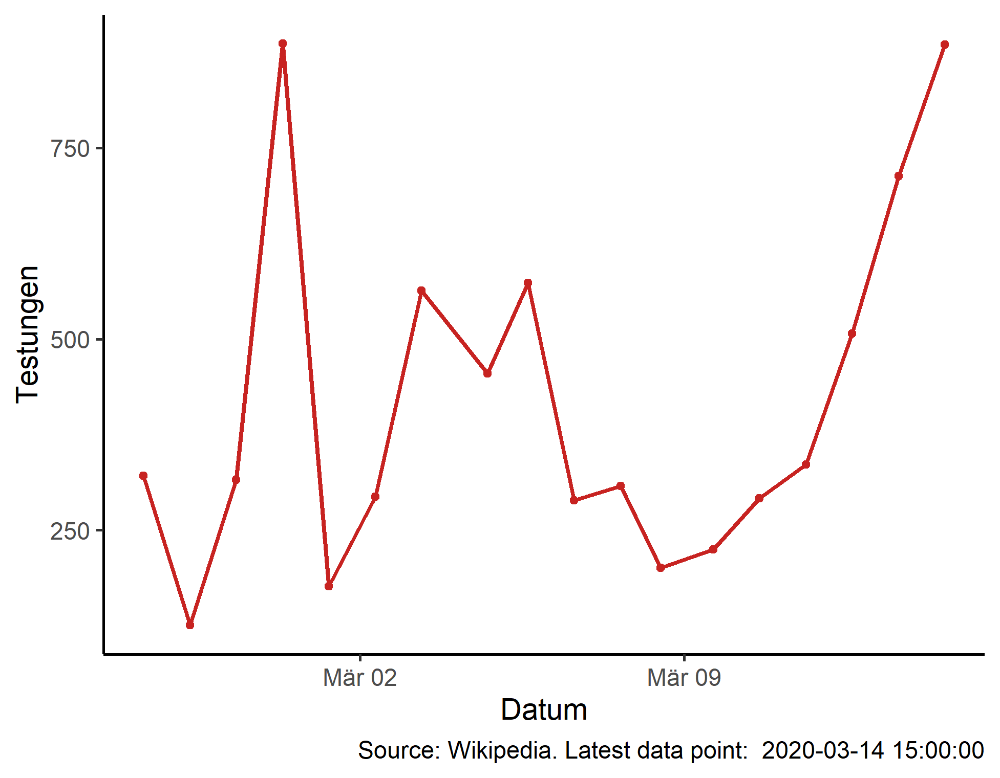

# Covid19-Austria

Script which scrapes Austrian infection data from wikipedia and produces figures on infections and infection to test ratios.

## Dependencies
rvest, tidyverse, xml2

## How to run
R covid19_at.R

### Creates these figures

