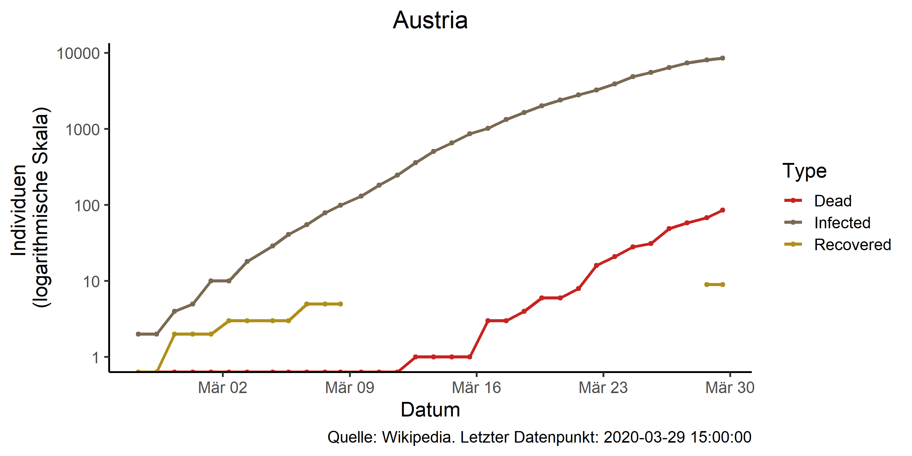

# Covid19-Austria

Package which scrapes Austrian infection data from wikipedia and produces figures on infections and infection to test ratios.
Automatically posts figures to twitter. (needs a twitter app configured).

## Installation
Works with package devtools (install before usage!).
<pre><code>
devtools::install_github("joph/covid19at")
</code></pre>

Please see [here](https://www.r-bloggers.com/send-tweets-from-r-a-very-short-walkthrough/) for how to configure twitteR in R.

## Example script
<pre><code>
library(covid19at)
library(ggplot2)

wikipedia_tables <- scrape_wikipedia()

wikipedia_tables_new <- wikipedia_tables[[1]]
wikipedia_tables_old <- wikipedia_tables[[2]]

theme_set(theme_classic(base_size = 14))

plot_prediction(wikipedia_tables_new,
                Sys.Date() + 6,
                3)
				
plot_compare_at_it()

plot_overview(wikipedia_tables_new)

plot_test_statistics(wikipedia_tables_new)

plot_number_tests(wikipedia_tables_new)

</code></pre>

### Creates these figures

