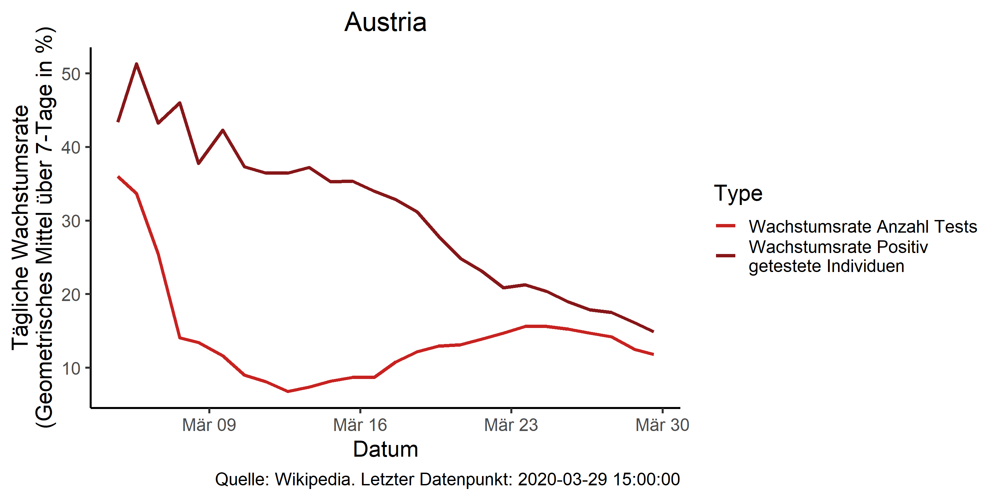
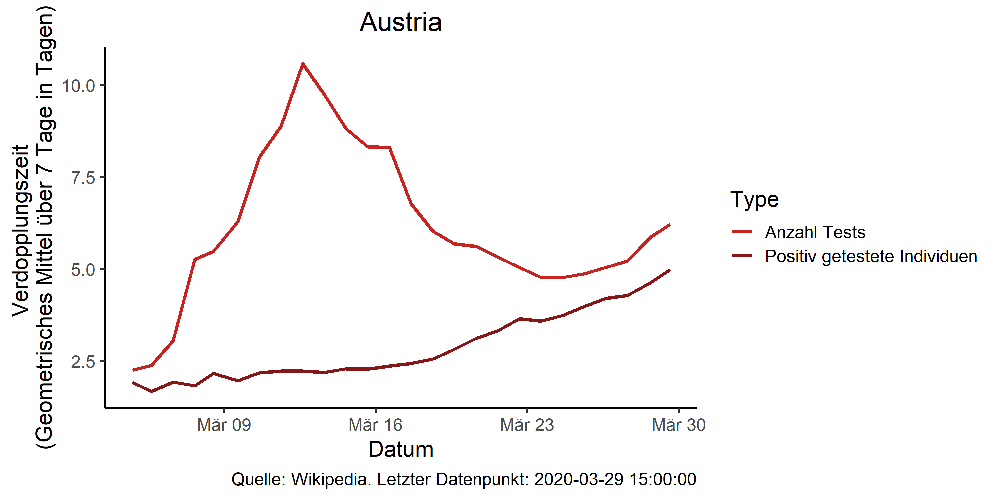
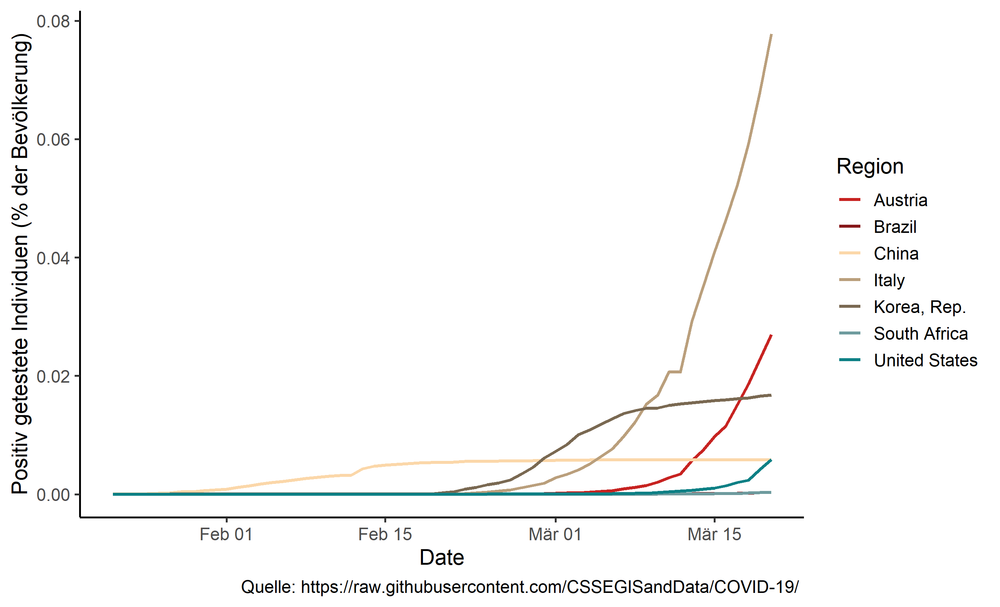
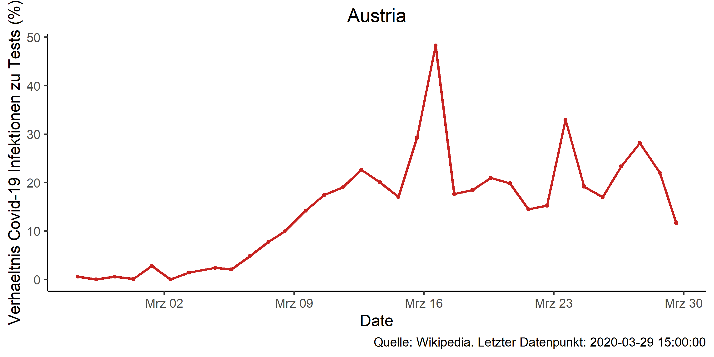

# Covid19-Austria

Package which scrapes Austrian Covid-19 infection data from wikipedia and downloads international Covid-19 data from [Johns Hopkins CSSE](https://github.com/CSSEGISandData/COVID-19/) and produces figures on infections and infection to test ratios.

## Installation
Works with package devtools (install before usage!).
<pre><code>
devtools::install_github("joph/covid19at")
</code></pre>

## Example script
<pre><code>
library(covid19at)
library(ggplot2)

theme_set(theme_classic(base_size = 14))

db_at <- covid19at::scrape_wikipedia_at()
db_international <- download_international_cases()

db_at <- manual_data_entry(db_at,
                           date = as.POSIXct("2020-03-21 08:00:00"),
                          cases_infected_cum = 2664,
                          cases_dead_cum = 7,
                          cases_recovered_cum = 9,
                          tests = 18545)

plot_growth_data(db_international,
                 "United Kingdom")

plot_growth_data(db_at)

plot_doubling_time(db_international,
                   "United Kingdom")

plot_doubling_time(db_at)

plot_overview(db_international,
              "United Kingdom")

plot_overview(db_at)

plot_prediction_combined(db_at,
                         db_international,
                         Sys.Date() + 4,
                         region1 = "Austria",
                         region2 = "Italy",
                         delay = 8,
                         polynom = 6,
                         exp = FALSE)

plot_country_comparison(db_international,
                        c("Austria",
                          "China",
                          "United States",
                          "United Kingdom",
                          "Italy",
                          "Brazil",
                          "South Africa"))

plot_infected_tests_ratio(db_at)

plot_number_tests(db_at)

plot_prediction(db_international,
                Sys.Date() + 4,
                region = "Italy")

</code></pre>

### Creates these figures

