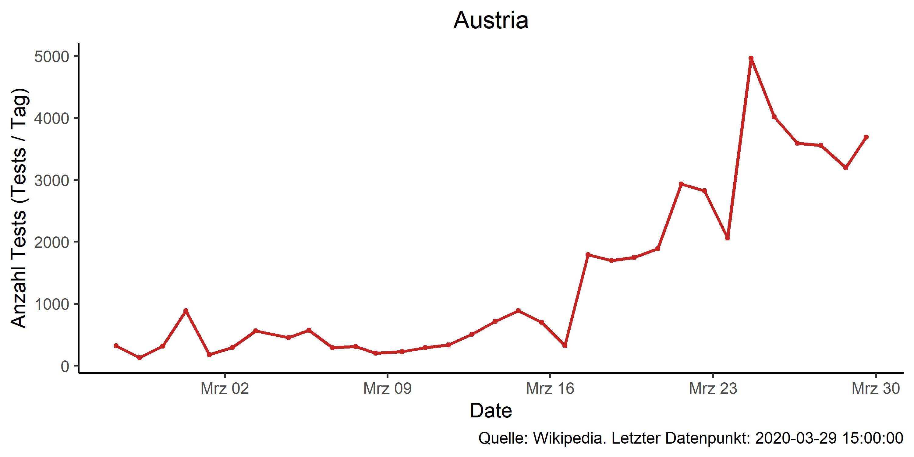
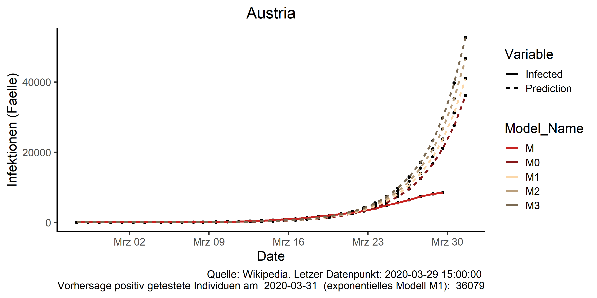
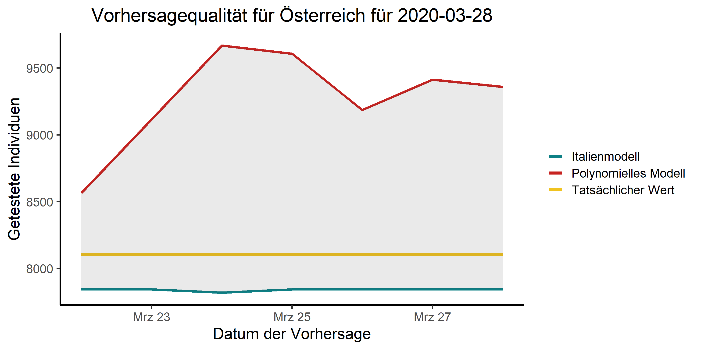
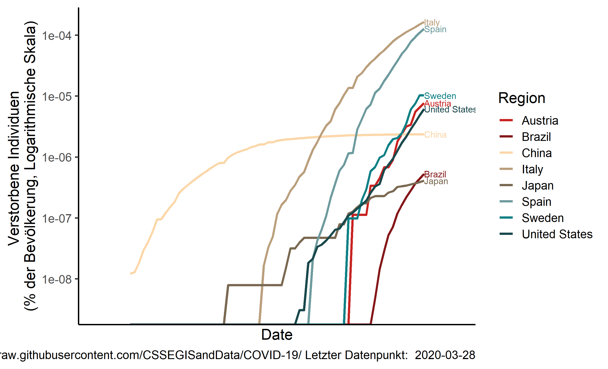

# Covid19-Austria

Package which scrapes Austrian Covid-19 infection data from wikipedia and downloads international Covid-19 data from [Johns Hopkins CSSE](https://github.com/CSSEGISandData/COVID-19/) and produces figures on infections and infection to test ratios.

## Installation
Works with package devtools (install before usage!).
<pre><code>
devtools::install_github("joph/covid19at")
</code></pre>

## Example script
See run_analysis.R for Austria
See run_analysis_brazil.R for Brazil

### Creates among others, these figures

